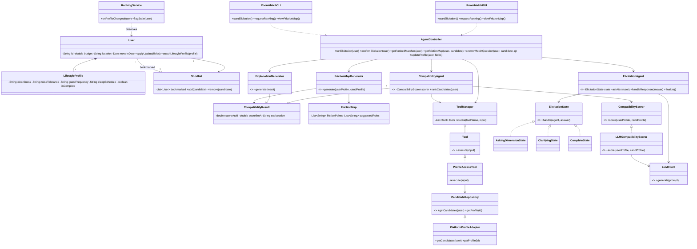
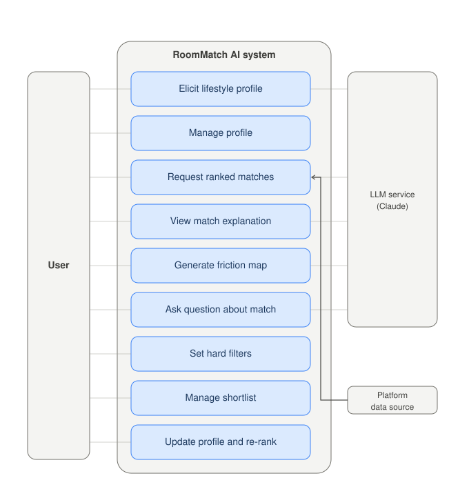
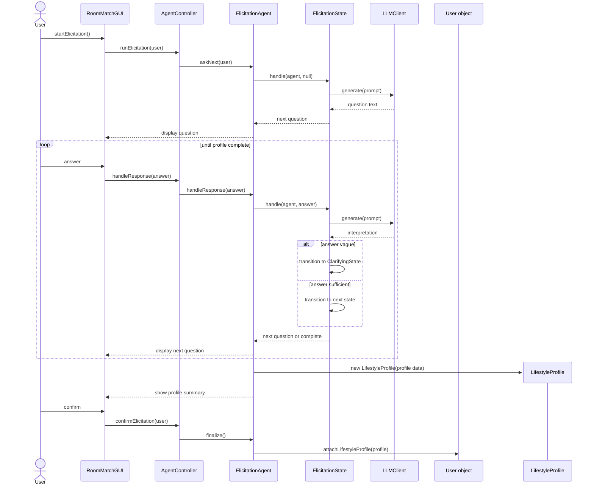
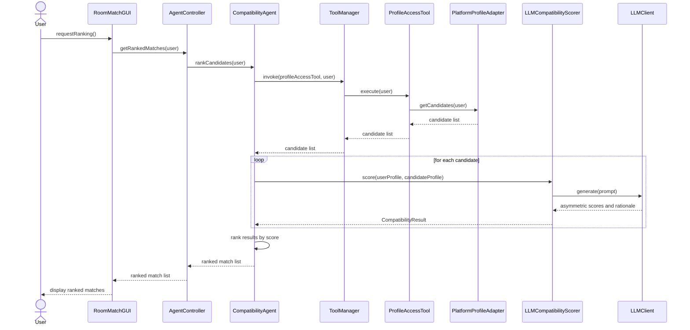
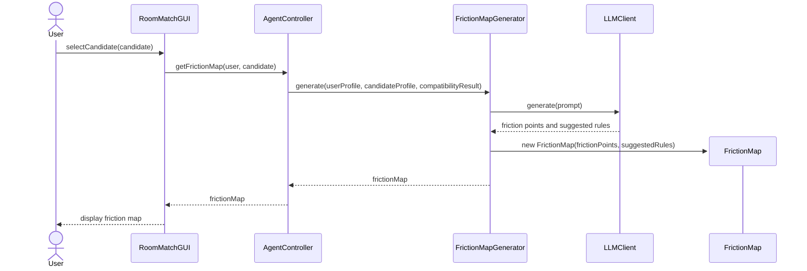
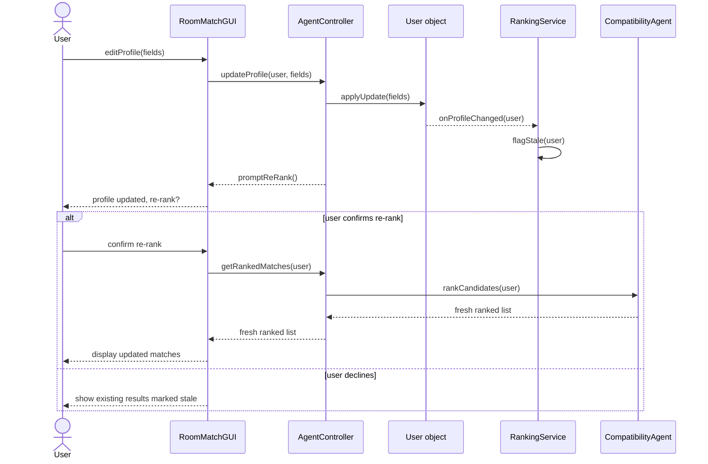

# EECS3311 Stage 1 Report: RoomMatch AI

An AI-powered roommate compatibility agent.

---

## 1. Project Overview

### Problem and Motivation
Roommate-matching platforms rely on static filters (budget, location, a one-line bio) that fail to capture the day-to-day habits and tolerances (cleanliness, noise, guests, sleep schedule) that actually cause conflict after two people move in together. Users often can't self-report these accurately in a checkbox form.

### Target Users
Students and young professionals using an existing roommate platform. RoomMatch AI is designed to plug into such a platform rather than build one from scratch. We assume a pool of profiles already exists, and user acquisition/practicality is out of scope for this project.

### Agent Description
RoomMatch AI does the following:
- Elicits real habits/tolerances via adaptive follow-up questions, not a checkbox form
- Ranks one user against many candidates, with explanations
- Models asymmetric friction (a tidy person may be more bothered by mess than vice versa)
- Explains why two people are or aren't compatible
- Generates a post-match "friction map": likely conflicts plus suggested house rules
- Answers natural-language questions about a match

**Why an AI agent is appropriate:** Retrieving candidate records is trivial, but interpreting them is not. The agent must interpret ambiguous self-descriptions ("pretty clean"), decide what to ask next based on prior answers, reason about asymmetric tolerance interactions with no fixed formula, and generate explanations tailored to each pair. This is judgment that changes case by case, not something static rules can do.

### AI/LLM Model
Claude (Anthropic) is used for elicitation, compatibility reasoning, explanation generation, and friction-map generation.

### Overall Architecture
The flow runs from GUI/CLI to controller to agent. Candidate data access is deterministic, handled by a repository layer. The agent calls it as a tool, deciding when to retrieve candidates as part of its plan (elicit, retrieve, reason, rank, explain). All interpretive work, including judging compatibility, ranking, and explaining, is the agent's job. Results return as structured output to the interface.

---

## 2. Detailed Feature Specifications

**F01 - Lifestyle Elicitation** *(AI)*
The user is guided through a conversational onboarding flow in the **GUI**, where the agent asks adaptive follow-up questions about daily habits such as cleanliness, noise, guests, and sleep schedule, rather than a static checkbox form. The agent interprets each free-text response, decides what to ask next based on it, and continues until it has enough signal to build a structured tolerance profile, which is shown to the user for confirmation before being saved by the GUI.
*Error cases:* Vague answers prompt a clarifying follow-up instead of a guess. An abandoned flow saves partial progress and flags incomplete dimensions before ranking runs. If the user disagrees with the agent's summarized interpretation, they can manually correct a value before confirming.

**F02 - Profile Setup & Editing** *(Deterministic)*
The user enters or edits structured account fields, including budget, location, and move-in date, directly through a form in the **GUI** (or via equivalent flags/prompts in the **CLI**). These values are validated and saved to the user's profile immediately, without agent involvement.
*Error cases:* Invalid input (e.g., negative budget, malformed date) is rejected with an inline message before saving. Required fields left blank block submission until completed.

**F03 - Candidate Ranking** *(AI)*
Once a profile is complete, the user requests matches through the **GUI** (or a `match` command in the **CLI**). The agent retrieves eligible candidates via the repository tool, reasons over each one's compatibility with the requesting user, and returns a ranked list displayed with a compatibility indicator per candidate.
*Error cases:* If no candidates remain after hard filters (F08) are applied, the system informs the user and suggests relaxing constraints. If the user's own profile is incomplete, ranking is blocked until F01/F02 are finished.

**F04 - Asymmetric Compatibility Scoring** *(AI)*
Internally invoked as part of F03, the agent reasons about how each candidate pair's tolerances interact in both directions. For example, a tidy user's sensitivity to a messy candidate is evaluated separately from the reverse, rather than producing a single symmetric score. The resulting asymmetric assessment feeds directly into the ranked list shown in the GUI/CLI.
*Error cases:* If either profile lacks data on a relevant dimension, that dimension is excluded from scoring and the gap is noted in the eventual explanation (F05) rather than silently assumed.

**F05 - Match Explanation** *(AI)*
For each ranked candidate shown in the **GUI**/**CLI**, the user can request "Why this match?" The agent generates a natural-language explanation grounded in the specific tolerance comparisons computed in F04, rather than a generic score description, and displays it alongside the ranked entry.
*Error cases:* If underlying scoring data is missing or stale, the agent regenerates it before explaining rather than explaining from outdated results.

**F06 - Friction Map Generation** *(AI)*
After the user selects a candidate from the ranked list in the **GUI**/**CLI**, the agent generates a friction map: likely points of conflict between the two profiles plus suggested house-rule starting points, displayed as a dedicated view the user can revisit.
*Error cases:* If the selected candidate's profile is incomplete, the agent generates a partial friction map and flags which dimensions couldn't be assessed.

**F07 - Match Q&A** *(AI)*
From a candidate's match view in the **GUI** (or an interactive `ask` mode in the **CLI**), the user types a free-form question about that candidate (e.g., "How would they feel about weeknight guests?"). The agent answers using that candidate's stored profile and prior compatibility reasoning.
*Error cases:* If the question can't be answered from available profile data, the agent says so explicitly rather than fabricating an answer.

**F08 - Hard Filters** *(Deterministic)*
Before ranking runs, the user sets non-negotiable constraints, such as budget range, location, and move-in date, through filter controls in the **GUI** (or filter flags in the **CLI**). These are applied deterministically to narrow the candidate pool prior to any AI reasoning in F03.
*Error cases:* Filters that eliminate the entire candidate pool trigger a warning before the ranking request is submitted, so the user can adjust before running an empty search.

**F09 - Saved Matches / Shortlist** *(Deterministic)*
From the ranked list or a candidate's detail view in the **GUI**/**CLI**, the user bookmarks a candidate to a persistent shortlist they can revisit without re-running ranking.
*Error cases:* Bookmarking a candidate whose profile has since been deleted or deactivated shows a clear "no longer available" state instead of a broken entry.

**F10 - Profile Update to Re-rank** *(Hybrid)*
When the user edits their profile (F02) or lifestyle answers (F01) through the **GUI**/**CLI**, the system detects the change and prompts the user to re-run candidate ranking (F03) so results reflect the update rather than becoming stale.
*Error cases:* If the user declines to re-rank, existing results are visibly marked as based on outdated profile data until they do.

---

## 3. UML Class Diagram

The `<<AI component>>` tag marks classes whose behavior is driven by LLM reasoning rather than fixed logic. All other classes are deterministic: data holders, repositories, or plain orchestration.

---

## 4. Design Pattern Explanations

**1. Facade: `AgentController`**
*Problem addressed:* The GUI and CLI would otherwise need direct references to five separate agent components, coupling both interfaces tightly to internal agent structure.
*Participants:* `AgentController` (facade); `ElicitationAgent`, `CompatibilityAgent`, `ExplanationGenerator`, `FrictionMapGenerator`, `ToolManager` (subsystem).
*Rationale:* Two interfaces, the GUI and the CLI, both need the same functionality. A facade lets them share one simple entry point instead of duplicating subsystem wiring in each. Without it, any change to the agent subsystem's internals would risk breaking both interfaces directly.

**2. Adapter: `PlatformProfileAdapter`**
*Problem addressed:* The agent needs candidate profile data, but the assignment assumes the system plugs into an existing platform whose actual data source is unspecified and out of our control.
*Participants:* `CandidateRepository` (target interface); `PlatformProfileAdapter` (adapter).
*Rationale:* It isolates the agent from the platform's specific data format and protocol. Without it, the agent's reasoning code would be coupled directly to platform-specific data access logic.

**3. Strategy: `CompatibilityScorer`**
*Problem addressed:* Asymmetric compatibility scoring is the project's core reasoning task, and how it's computed shouldn't be hardwired into the agent that uses it.
*Participants:* `CompatibilityScorer` (strategy interface); `LLMCompatibilityScorer` (concrete strategy); `CompatibilityAgent` (context).
*Rationale:* This keeps the scoring algorithm interchangeable and testable independently of the agent that orchestrates ranking. Without it, `CompatibilityAgent` would have scoring logic embedded directly in it.

**4. State: `ElicitationAgent`**
*Problem addressed:* The adaptive elicitation conversation has distinct modes (asking, clarifying, done), and tracking that with flags and conditionals would get unwieldy.
*Participants:* `ElicitationState` (state interface); `AskingDimensionState`, `ClarifyingState`, `CompleteState` (concrete states); `ElicitationAgent` (context).
*Rationale:* The conversation genuinely has distinct modes with different behavior in each. Without it, `ElicitationAgent` would need a growing set of if/else branches tracking an internal phase flag.

**5. Observer: `RankingService`**
*Problem addressed:* When a user edits their profile, previously computed rankings become stale, but the profile-editing code shouldn't need to know about ranking internals to trigger that check.
*Participants:* `User` (subject); `RankingService` (observer).
*Rationale:* This decouples "a profile changed" from "something needs to happen to rankings because of it." Without it, every profile-editing code path would need to remember to manually check and invalidate rankings.

---

## 5 & 6. Use-Case Diagram and Detailed Use-Case Descriptions

Actors: **User** (primary), **Platform data source** (external, supports candidate retrieval), **LLM service, Claude** (external, supports AI reasoning). All 9 use cases below cover all 10 features (F04 folds into UC03 as an internal reasoning step, not a separate user-facing interaction). **UC09 extends UC02**: it only triggers when an edit actually changes ranking-relevant data.

**UC01 - Elicit lifestyle profile.** *Actor:* User. *Goal:* Build a structured tolerance profile through conversation. *Preconditions:* User has an account. *Trigger:* User starts onboarding or requests to redo their profile. *Main flow:* Agent asks a question, user responds, agent interprets and asks a follow-up or moves on, repeats until profile is complete, user confirms. *Alt/exception flows:* Vague answer leads to agent clarifying; user abandons and partial profile is saved. *Postcondition:* A complete or partial `LifestyleProfile` is saved. *Related feature:* F01.

**UC02 - Manage profile.** *Actor:* User. *Goal:* Set or edit account fields. *Preconditions:* User is logged in. *Trigger:* User opens profile settings. *Main flow:* User edits fields, system validates, then saves. *Alt/exception flows:* Invalid input rejected inline; required field blank blocks save. *Postcondition:* `User` record updated. *Related feature:* F02.

**UC03 - Request ranked matches.** *Actor:* User; supported by Platform data source, LLM service. *Goal:* Get a ranked list of compatible candidates. *Preconditions:* User's profile and lifestyle data are complete; hard filters (if any) are set. *Trigger:* User requests matches. *Main flow:* Agent retrieves candidates via the repository tool, reasons over asymmetric compatibility for each, ranks them, and returns the list. *Alt/exception flows:* No candidates after filters leads the system to suggest relaxing constraints; incomplete profile blocks ranking and redirects to UC01/UC02. *Postcondition:* A ranked `CompatibilityResult` list is returned. *Related feature:* F03, F04.

**UC04 - View match explanation.** *Actor:* User; supported by LLM service. *Goal:* Understand why a candidate was ranked as they were. *Preconditions:* A ranked list exists. *Trigger:* User selects "why this match?" on a candidate. *Main flow:* Agent generates an explanation from the stored `CompatibilityResult` and displays it. *Alt/exception flows:* Scoring data missing or stale leads the agent to regenerate it before explaining. *Postcondition:* Explanation displayed to user. *Related feature:* F05.

**UC05 - Generate friction map.** *Actor:* User; supported by LLM service. *Goal:* Get likely friction points and house-rule suggestions for a selected candidate. *Preconditions:* User has selected a candidate from a ranked list. *Trigger:* User confirms a match selection. *Main flow:* Agent compares both profiles, generates friction points and suggested rules, and displays them as a dedicated view. *Alt/exception flows:* Candidate profile incomplete leads to a partial map with gaps flagged. *Postcondition:* `FrictionMap` created and viewable. *Related feature:* F06.

**UC06 - Ask question about match.** *Actor:* User; supported by LLM service. *Goal:* Get a natural-language answer about a specific candidate. *Preconditions:* Candidate's match view is open. *Trigger:* User types a free-form question. *Main flow:* Agent answers using the candidate's profile and prior compatibility reasoning. *Alt/exception flows:* Question unanswerable from available data leads the agent to say so explicitly. *Postcondition:* Answer displayed. *Related feature:* F07.

**UC07 - Set hard filters.** *Actor:* User. *Goal:* Narrow the candidate pool by non-negotiable constraints. *Preconditions:* None. *Trigger:* User opens filter controls before requesting matches. *Main flow:* User sets budget/location/move-in constraints, and the system applies them deterministically before ranking. *Alt/exception flows:* Filters eliminate the entire pool, triggering a warning shown before submission. *Postcondition:* Filtered candidate pool ready for UC03. *Related feature:* F08.

**UC08 - Manage shortlist.** *Actor:* User. *Goal:* Bookmark candidates to revisit later. *Preconditions:* A ranked list or candidate detail view is open. *Trigger:* User bookmarks or removes a candidate. *Main flow:* System adds or removes the candidate from `Shortlist`. *Alt/exception flows:* A bookmarked candidate later deactivated is shown as "no longer available." *Postcondition:* `Shortlist` updated. *Related feature:* F09.

**UC09 - Update profile and re-rank.** *Actor:* User. *Goal:* Keep ranked results consistent with the latest profile data. *Preconditions:* User has existing ranked results. *Trigger:* User edits profile (UC02) or lifestyle answers (UC01) in a way that affects ranking. *Main flow:* `RankingService` detects the change, flags existing results as stale, and prompts the user to re-run UC03. *Alt/exception flows:* If the user declines to re-rank, results remain visibly marked stale. *Postcondition:* Results either refreshed or clearly marked outdated. *Related feature:* F10. *Extends:* UC02.

---

## 7. Sequence Diagrams

Four diagrams cover every design pattern and every distinct interaction shape in the system. UC02, UC07, and UC08 are simple validate-and-save or add/remove operations with no distinct pattern behavior and are not separately diagrammed. UC04 (Match Explanation) and UC06 (Match Q&A) follow the same structural shape as Diagram 3 (fetch stored result, call LLM, return content) and are not separately diagrammed either.

### 7.1 Lifestyle Elicitation (F01 / UC01): State pattern

### 7.2 Candidate Ranking (F03 / F04 / UC03): Adapter and Strategy patterns

### 7.3 Friction Map Generation (F06 / UC05)

### 7.4 Profile Update to Re-rank (F10 / UC09): Observer pattern

---

## 8. Feature-to-Design Traceability Table

| Feature | Use Case | Key Classes | Key Methods | Sequence Diagram | Design Pattern(s) |
|---|---|---|---|---|---|
| F01 Lifestyle Elicitation | UC01 | `ElicitationAgent`, `ElicitationState`, `AskingDimensionState`, `ClarifyingState`, `CompleteState`, `LLMClient`, `LifestyleProfile`, `User` | `askNext()`, `handleResponse()`, `handle()`, `confirmElicitation()`, `finalize()`, `attachLifestyleProfile()` | 7.1 | State |
| F02 Profile Setup & Editing | UC02 | `User`, `AgentController` | `updateProfile()`, `applyUpdate()` | None (simple CRUD) | None |
| F03 Candidate Ranking | UC03 | `AgentController`, `CompatibilityAgent`, `ToolManager`, `ProfileAccessTool`, `PlatformProfileAdapter`, `CandidateRepository`, `LLMCompatibilityScorer`, `LLMClient` | `getRankedMatches()`, `rankCandidates()`, `invoke()`, `execute()`, `getCandidates()`, `score()` | 7.2 | Facade, Adapter, Strategy |
| F04 Asymmetric Compatibility Scoring | UC03 (internal) | `CompatibilityScorer`, `LLMCompatibilityScorer`, `LLMClient`, `CompatibilityResult` | `score()`, `generate()` | 7.2 | Strategy |
| F05 Match Explanation | UC04 | `AgentController`, `ExplanationGenerator`, `CompatibilityResult` | `generate()` | Same shape as 7.3 | Facade |
| F06 Friction Map Generation | UC05 | `AgentController`, `FrictionMapGenerator`, `LLMClient`, `CompatibilityResult`, `FrictionMap` | `getFrictionMap()`, `generate()` | 7.3 | Facade |
| F07 Match Q&A | UC06 | `AgentController`, `LLMClient` | `answerMatchQuestion()` | Same shape as 7.3 | Facade |
| F08 Hard Filters | UC07 | `CandidateRepository`, `PlatformProfileAdapter`, `User` | `getCandidates()` (filtered) | Folds into 7.2's data-fetch step | Adapter |
| F09 Saved Matches / Shortlist | UC08 | `Shortlist`, `User` | `add()`, `remove()` | None (simple aggregation) | None |
| F10 Profile Update to Re-rank | UC09 | `User`, `RankingService`, `AgentController`, `CompatibilityAgent` | `applyUpdate()`, `onProfileChanged()`, `flagStale()`, `rankCandidates()` | 7.4 | Observer |

---

## 9. Feature Implementation Explanations

**F01 - Lifestyle Elicitation.** The GUI/CLI calls `AgentController.runElicitation(user)`, which delegates to `ElicitationAgent.askNext(user)`. The agent holds a reference to its current `ElicitationState` and calls `handle()` on it. That state calls `LLMClient.generate()` to phrase a question, and on each user reply, it interprets the answer and decides whether to transition to `ClarifyingState`, the next `AskingDimensionState`, or `CompleteState`. Once complete, the agent creates a `LifestyleProfile`, and once the user confirms, `AgentController.confirmElicitation()` calls `ElicitationAgent.finalize()`, which calls `User.attachLifestyleProfile()` to attach it. See section 7.1.

**F02 - Profile Setup & Editing.** The GUI/CLI calls `AgentController.updateProfile(user, fields)`, which delegates to `User.applyUpdate(fields)` after validation. No AI or agent classes are involved.

**F03 - Candidate Ranking.** `AgentController.getRankedMatches(user)` delegates to `CompatibilityAgent.rankCandidates(user)`, which invokes `ToolManager` to run `ProfileAccessTool`. That tool calls `PlatformProfileAdapter.getCandidates()` (implementing `CandidateRepository`) to retrieve the eligible pool. For each candidate, the agent calls `LLMCompatibilityScorer.score()` (the concrete `CompatibilityScorer` strategy), which calls `LLMClient.generate()` to reason about the pair and returns a `CompatibilityResult`. The agent sorts these into a ranked list. See section 7.2.

**F04 - Asymmetric Compatibility Scoring.** This is not a separate call path but the reasoning inside `LLMCompatibilityScorer.score()` from F03. The LLM prompt evaluates both directions of tolerance (user to candidate and candidate to user) independently, and both values are stored on the resulting `CompatibilityResult` rather than collapsed into one symmetric number. See section 7.2.

**F05 - Match Explanation.** `AgentController` calls `ExplanationGenerator.generate(result)`, passing the relevant `CompatibilityResult` computed during F03/F04. The generator calls `LLMClient` to turn the stored asymmetric scores into a natural-language explanation, returned to the interface. This is structurally identical to section 7.3, with `ExplanationGenerator` in place of `FrictionMapGenerator`.

**F06 - Friction Map Generation.** `AgentController.getFrictionMap(user, candidate)` calls `FrictionMapGenerator.generate()`, passing both profiles and the existing `CompatibilityResult`. The generator calls `LLMClient.generate()` to produce friction points and suggested rules, then constructs a `FrictionMap` object returned to the interface. See section 7.3.

**F07 - Match Q&A.** `AgentController.answerMatchQuestion(user, candidate, question)` passes the candidate's profile, the stored `CompatibilityResult`, and the user's free-text question to `LLMClient.generate()`, which grounds its answer in that data rather than fabricating one. This is structurally identical to section 7.3, with the LLM called directly by the controller rather than through a dedicated generator class, since no persistent output object is produced.

**F08 - Hard Filters.** The GUI/CLI passes filter constraints into the same `PlatformProfileAdapter.getCandidates()` call used in F03, narrowing the pool before any AI reasoning runs. No new classes are introduced.

**F09 - Saved Matches / Shortlist.** The GUI/CLI calls `Shortlist.add(candidate)` or `Shortlist.remove(candidate)` directly. No agent or LLM involvement.

**F10 - Profile Update to Re-rank.** When `User.applyUpdate()` (F02) or `User.attachLifestyleProfile()` (F01) modifies the user's data, it notifies `RankingService.onProfileChanged(user)`, which calls `flagStale()` for that user's existing rankings. The profile classes only know they changed, not that ranking logic depends on it. If the user opts to re-rank, the flow re-enters `CompatibilityAgent.rankCandidates()` from F03. See section 7.4.
